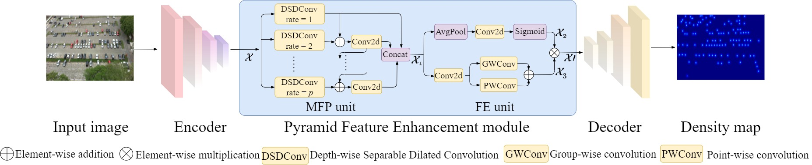
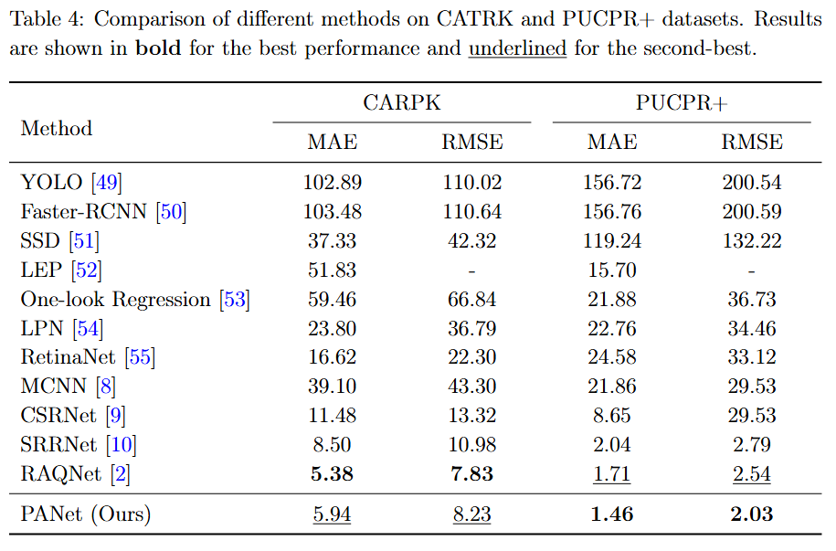
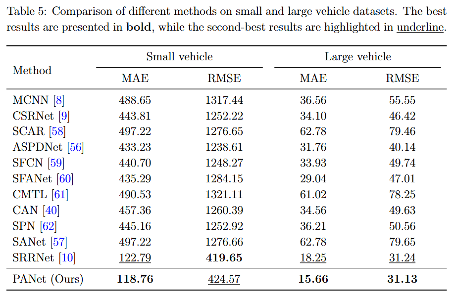
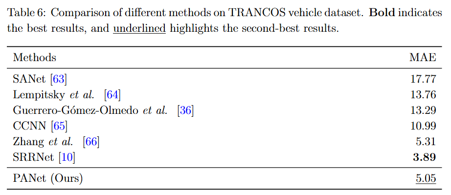
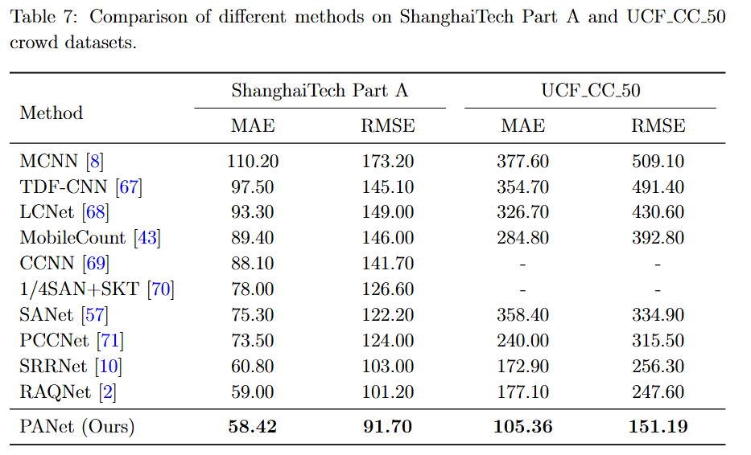
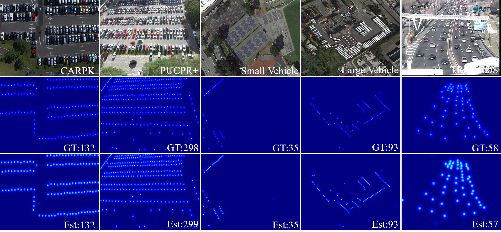
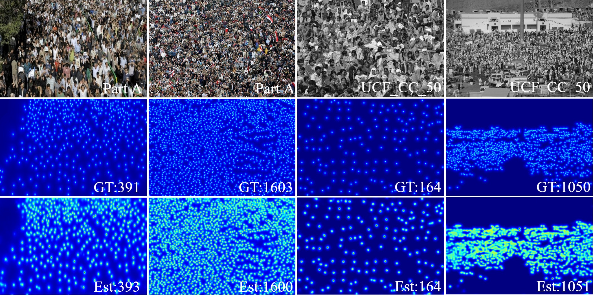

# Efficient Vehicular Counting via Privacy-aware Aggregation Network

This repository contains the code and resources associated with our paper titled "Efficient Vehicular Counting via Privacy-aware Aggregation Network". Please note that the paper is currently under review for publication.

The code is tested on Ubuntu 22.04 environment (Python3.8.18, PyTorch1.10.0) with an NVIDIA GeForce RTX 3090.

## Contents

- [Efficient Vehicular Counting via Privacy-aware Aggregation Network]
  - [Introduction](#introduction)
  - [Train](#train)
  - [Test](#test)
  - [Pretrained Weights](#pretrained-weights)
  - [Results](#results)
    - [Quantitative Results](#quantitative-results)
    - [Visual Results](#visual-results)
  - [Citation](#citation)
  - [Acknowledgements](#acknowledgements)

## Introduction

To address the challenges of vehicle counting in real-world applications, we propose the Efficient Vehicular Counting via Privacy-aware Aggregation Network (PANet). PANet integrates a Pyramid Feature Enhancement (PFE) module, which captures multi-scale features effectively and improves the representation of key features. By optimizing channel-wise outputs, the computational complexity is significantly reduced. Moreover, PANet employs a federated learning framework to distribute computational tasks among devices, ensuring robust privacy protection and minimizing the possibility of data leakage.



## Train

1. Prepare the datasets used in the experiment.
2. Modify the data set address in `make_npydata.py` to generate the correct dataset information
3. Modify the dataset, client numbers and other options in `config.py`.
4. After performing the above modifications, you can start the training process by running `python train.py`.

## Test

To test PANet, update the `pre` argument in `config.py` with the path to the pretrained model. Then, initiate the testing process by running `python test.py`.

## Pretrained Weights

The pretrained weights from [HERE](https://1drv.ms/f/s!Al2dMJC6HUgQrJRUCo3Ighr21TXMwg?e=dSQTCy).

## Results

### Quantitative Results






### Visual Results





## Citation

If you find this code or research helpful, please consider citing our paper:

```BibTeX
@article{cheng2025efficient,
  title={Efficient vehicular counting via privacy-aware aggregation network},
  author={Cheng, Jing-an and Li, Qilei and Chen, Jinyong and Gao, Mingliang},
  journal={Measurement Science and Technology},
  volume={36},
  number={2},
  pages={026213},
  year={2025},
  publisher={IOP Publishing}
}
```

## Acknowledgements

This code is built on [DSPI](https://github.com/jinyongch/DSPI) and [FIDTM](https://github.com/dk-liang/FIDTM). We thank the authors for sharing their codes.
